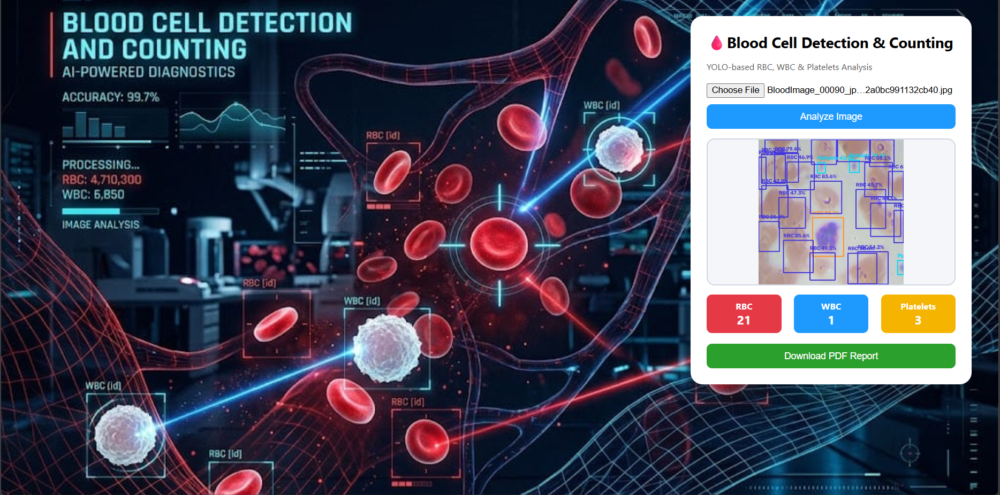
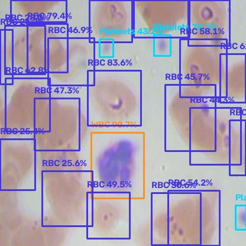
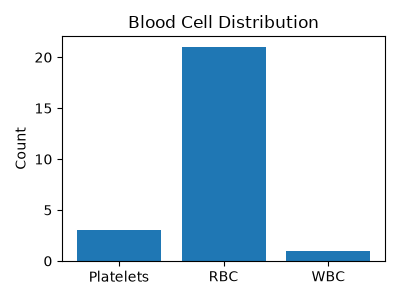

# 🩸 Blood Cell Detection & Counting (YOLO)

**Automated red blood cell, white blood cell, and platelet detection from microscopic blood smear images, powered by a YOLO26n object detection model and served through a Flask web dashboard.**

<p>
  
  
  
  
  
  
  
</p>

---

## 📑 Table of Contents

- [Introduction](#-introduction)
- [Features](#-features)
- [Installation](#-installation)
- [Usage](#-usage)
- [Screenshots](#-screenshots)
- [Technologies](#-technologies)
- [Contributing](#-contributing)
- [License](#-license)
- [Contact](#-contact)
- [Acknowledgments](#-acknowledgments)

---

## 📖 Introduction

A complete blood count (CBC) is one of the most common diagnostic tests in medicine, but manually counting red blood cells (RBCs), white blood cells (WBCs), and platelets under a microscope with a hemocytometer is **slow, repetitive, and prone to human error**.

This project automates that process. It fine-tunes a **YOLO26n** object detection model on annotated blood smear microscopy images so it can localize and classify individual blood cells in a single forward pass, then wraps the model in a lightweight **Flask** web application that lets a user:

1. Upload a blood smear image,
2. Instantly see each detected cell outlined and labeled with its class and confidence score, and
3. Download a formatted PDF lab report summarizing the results.

The goal is to demonstrate how a modern, lightweight object detector can turn a tedious manual laboratory task into a near-instant, automated analysis — useful as a learning project, a research baseline, or the foundation for a larger diagnostic tool.

> ⚠️ **Disclaimer:** This is a research/educational project. It is **not** a certified medical device and should not be used for real clinical diagnosis without proper validation.

---

## ✨ Features

- 🔬 **Three-class blood cell detection** — identifies **RBCs**, **WBCs**, and **Platelets** in a single image.
- 📤 **Simple web upload interface** — drag/select an image and analyze it with one click, no coding required.
- 🖼️ **Annotated image output** — bounding boxes, class labels, and confidence percentages are drawn directly on the image, color-coded per cell type.
- 🔢 **Live cell count dashboard** — RBC, WBC, and Platelet counts update instantly after analysis.
- 📄 **One-click PDF report generation** — produces a formatted hematology report with the annotated image, a cell-distribution bar chart, and a count summary table (via ReportLab + Matplotlib).
- ⚡ **Lightweight nano model** — YOLO26n has ~2.37M parameters and ~5.3 GFLOPs, making inference fast even without a high-end GPU.
- 📓 **Reproducible training notebook** — `train.ipynb` documents the exact training run (Google Colab + GPU) used to produce the shipped weights.
- 🧪 **Pre-trained weights included** — `models/best.pt` is already in the repo, so you can run detection immediately without training first.

### 📊 Model Performance

The shipped model (`models/best.pt`) was trained for 10 epochs at 640×640 resolution and evaluated on the validation split (73 images / 967 annotated cells):

| Metric | All Classes | Platelets | RBC | WBC |
|---|---|---|---|---|
| Precision | 88.8% | 85.0% | 84.9% | 96.5% |
| Recall | 86.2% | 81.7% | 76.8% | 100% |
| mAP@0.5 | 92.6% | 90.2% | 89.8% | 97.7% |
| mAP@0.5:0.95 | 65.5% | 51.1% | 64.2% | 81.3% |

*(Figures are taken directly from the training run in `train.ipynb`. WBC detection is the strongest class; RBC and Platelets — which are smaller and more densely packed in a smear — score lower on the stricter mAP@0.5:0.95 metric, which is typical for small, overlapping-object detection tasks.)*

---

## ⚙️ Installation

### Prerequisites

- Python **3.9+**
- `pip`
- `git`
- (Optional but recommended) A virtual environment tool such as `venv` or `conda`

### Steps

1. **Clone the repository**

   ```bash
   git clone https://github.com/AmmarMohamed0/blood-cell-detection-yolo.git
   cd blood-cell-detection-yolo
   ```

2. **Create and activate a virtual environment** *(recommended)*

   ```bash
   python -m venv venv

   # macOS / Linux
   source venv/bin/activate

   # Windows
   venv\Scripts\activate
   ```

3. **Install the dependencies**

   ```bash
   pip install -r requirements.txt
   ```

   This installs Flask, Ultralytics (YOLO), OpenCV, and ReportLab; NumPy and Matplotlib are pulled in automatically as Ultralytics dependencies.

4. **Verify the model weights are present**

   A trained model is already included at `models/best.pt`, so no separate download step is required. If you'd rather train your own, see [Training your own model](#training-your-own-model) below.

5. **Run the application**

   ```bash
   python app.py
   ```

6. **Open the app** in your browser at:

   ```
   http://127.0.0.1:5000
   ```

### Training your own model

Model training is documented in [`train.ipynb`](train.ipynb) (built for Google Colab with a GPU runtime):

```python
from ultralytics import YOLO

model = YOLO("yolo26n.pt")
model.train(
    data="data.yaml",
    epochs=10,
    imgsz=640,
    batch=8,
    device="cuda"
)
```

The dataset is defined in [`data.yaml`](data.yaml) and follows the standard Ultralytics YOLO format (one `.txt` label file per image, normalized `class x_center y_center width height`):

```yaml
train: train/images
val: valid/images
test: test/images

nc: 3
names:
  0: Platelets
  1: RBC
  2: WBC
```

> 💡 `data.yaml` currently points `path` at a Google Drive location used for the original Colab run — update it to a local path (e.g. `./data`) before retraining on your own machine.

---

## 🚀 Usage

### Via the web dashboard

1. Start the server with `python app.py` and open `http://127.0.0.1:5000`.
2. Click the file input and select a blood smear image (JPG/PNG).
3. Click **Analyze Image** — the image is sent to the backend, run through the YOLO model, and returned annotated with bounding boxes.
4. The **RBC**, **WBC**, and **Platelets** count cards update automatically.
5. Click **Download PDF Report** to generate and download a formatted lab report of the current results.

### Via the REST API directly

The Flask app exposes a `/predict` endpoint that accepts a multipart image upload:

```bash
curl -X POST http://127.0.0.1:5000/predict \
  -F "image=@path/to/blood_smear.jpg"
```

Example response:

```json
{
  "counts": { "Platelets": 3, "RBC": 21, "WBC": 1 },
  "boxes": [
    {
      "x": 120, "y": 45, "w": 60, "h": 55,
      "label": "RBC", "confidence": 83.6,
      "color": "rgb(220, 53, 69)"
    }
  ],
  "image": "/static/output/processed.jpg"
}
```

Once you've analyzed an image, a report can be downloaded from:

```bash
curl -OJ http://127.0.0.1:5000/download-report
```

### Via the model directly (no web server)

```python
from ultralytics import YOLO

model = YOLO("models/best.pt")
results = model("path/to/blood_smear.jpg")

results[0].show()          # display the annotated image
print(results[0].boxes)    # inspect raw detections
```

### Class / color legend

| Class | Label | Box Color |
|---|---|---|
| 0 | Platelets | 🟡 Gold `rgb(255, 215, 0)` |
| 1 | RBC | 🔴 Red `rgb(220, 53, 69)` |
| 2 | WBC | 🔵 Blue `rgb(30, 144, 255)` |

---

## 🖼️ Screenshots

**Web dashboard** — the app after analyzing a sample blood smear image:



**Detected blood cells** — bounding boxes with class labels and confidence scores, output by `/predict`:



**Auto-generated cell distribution chart**, included in the downloadable PDF report:



---

## 🛠️ Technologies

**Backend**
- [Python 3](https://www.python.org/)
- [Flask](https://flask.palletsprojects.com/) — web server & REST API

**Computer Vision / Machine Learning**
- [Ultralytics YOLO (YOLO26n)](https://www.ultralytics.com/) — object detection model
- [OpenCV](https://opencv.org/) — image decoding, drawing bounding boxes/labels
- [NumPy](https://numpy.org/) — array/image buffer handling

**Reporting & Visualization**
- [Matplotlib](https://matplotlib.org/) — cell distribution chart generation
- [ReportLab](https://www.reportlab.com/) — PDF report generation

**Frontend**
- HTML5 / CSS3
- Vanilla JavaScript (`fetch` API, canvas-free DOM rendering)

**Training environment**
- Jupyter Notebook / Google Colab (GPU: Tesla T4)

---

## 🤝 Contributing

Contributions, issues, and feature requests are welcome!

1. **Fork** the repository.
2. **Create a feature branch**
   ```bash
   git checkout -b feature/your-feature-name
   ```
3. **Make your changes** and commit them
   ```bash
   git commit -m "Add: short description of your change"
   ```
4. **Push to your fork**
   ```bash
   git push origin feature/your-feature-name
   ```
5. **Open a Pull Request** describing what you changed and why.

Please keep pull requests focused and, where possible, open an issue first to discuss significant changes (e.g. model architecture swaps, new endpoints, dataset changes) before investing time in a PR.

---

## 📄 License

This project is licensed under the **[MIT License](LICENSE)** — you are free to use, copy, modify, merge, publish, distribute, sublicense, and/or sell copies of this project, provided the original copyright notice and license text are included. See the [`LICENSE`](LICENSE) file for the full text.

---

## 📬 Contact

**Author:** Ammar Mohamed ([@AmmarMohamed0](https://github.com/AmmarMohamed0))

- 🔗 Project repository: [github.com/AmmarMohamed0/blood-cell-detection-yolo](https://github.com/AmmarMohamed0/blood-cell-detection-yolo)
- 🐛 Bugs / feature requests: please [open an issue](https://github.com/AmmarMohamed0/blood-cell-detection-yolo/issues) on the repository

---

## 🙏 Acknowledgments

- [Ultralytics](https://github.com/ultralytics/ultralytics) for the YOLO object detection framework.
- The [BCCD (Blood Cell Count and Detection) Dataset](https://github.com/Shenggan/BCCD_Dataset), with original data and annotations from **cosmicad** and **akshaylamba**, which this project's dataset (`BloodImage_*` images) is derived from.
- [Roboflow](https://roboflow.com/) for tooling used to export the dataset into YOLO format.
- The open-source communities behind [Flask](https://flask.palletsprojects.com/), [OpenCV](https://opencv.org/), [Matplotlib](https://matplotlib.org/), and [ReportLab](https://www.reportlab.com/).

---

<p align="center">Made with 🩸 and a lot of bounding boxes.</p>
